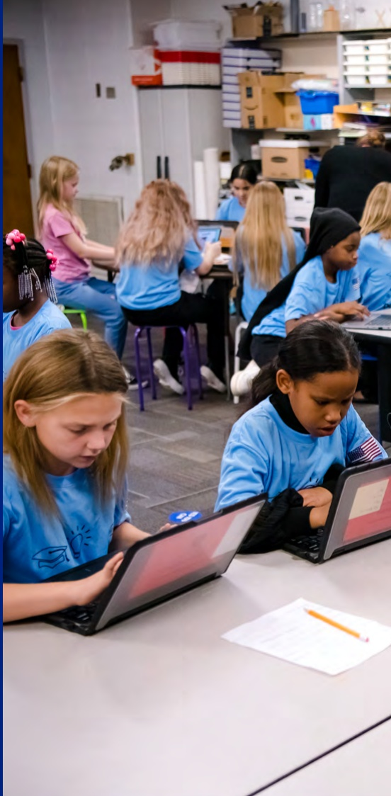

## A message from our VP, Corporate Sustainability and ESG

We actively support our customers and partners in achieving their goals while making a lasting impact for business, people and the planet.

Our approach includes embedding Sustainability and Environmental, Social and Governance (ESG) throughout our value chain and technology stack. We engage our supply chain to drive emissions reductions, use innovative materials and takeback programs to advance the circular economy and collaborate with nonprofits with the aim to bring everyone access to the benefits of technology.

Our FY24 ESG Report is one way we're holding ourselves accountable against our ambitious goals for 2030 and beyond, and we continue to invest in initiatives that apply our technology, scale and talented workforce to address complex challenges like climate change, accelerating the circular economy, creating inclusive workplaces and addressing the digital divide.

Our FY24 highlights include:

Closing in on our packaging goal, with 96.4% of packaging across our entire product portfolio made with recycled or renewable materials.

• 949,000 hours of volunteer work logged by our team members, spanning community projects such as park cleanups to skill-based work through the Pro Bono program.

Over 396 million people benefiting from our digital inclusion programs, partnerships and innovation since FY20. These efforts provide access to technology, connectivity, digital skills and support for under-resourced communities around the world.

• Receipt of a platinum EcoVadis 2023 medal for scoring in the top 1% of companies assessed across four major themes: environment, labor and human rights, ethics and sustainable procurement.

Launched more products featuring recycled, renewable and reduced carbon emissions materials. In FY24, we used over 43 million kg (95 million lbs) of sustainable materials in our products and were the first in the industry to ship certified 50% recycled content steel in our displays.

Underpinning all these highlights are our continued partnerships and collaboration inside and outside our organization. And as we explore the opportunities and address the environmental and social impacts that come with AI, we will continue to work alongside and support our customers, partners and communities.

The next phase of how we use technology to create meaningful impact, build trust and create a more sustainable and inclusive world for everyone is a phase unlike any before, and one we're excited to embark on together.

Casuit-Tuba

Cassandra Garber

Vice President, Corporate Sustainability and ESG

