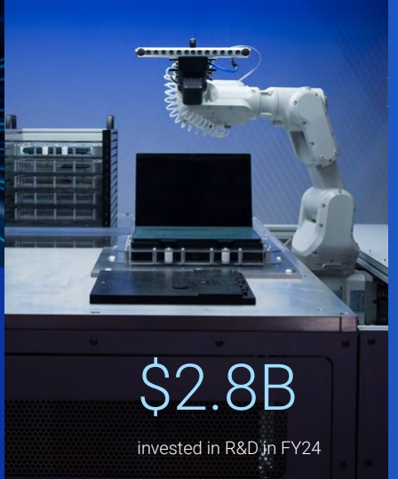
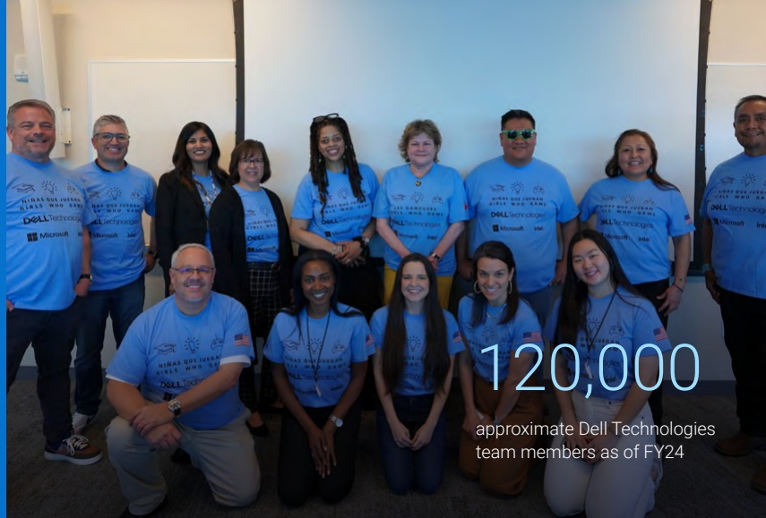

## Our business

Dell Technologies' integrated solutions help customers modernize their IT infrastructure, manage and operate in a multicloud world, address workforce transformation, and provide critical solutions that keep people and organizations connected.

99%

of Fortune 500 served as of FY24

### $88.4B

in FY24 revenue

$2.8B invested in R&D in FY24

$2.8B invested in R&D in FY24

170+

approximate number of countries Dell operates in globally

### No. 1

in client business, high-end gaming, purpose-built backup appliance, workstations, server, storage software, PC monitors, external storage, hyperconverged and converged systems $ ^{*} $

☀️

ＤＬＡＡＡＡＡＡＡＡＡＡＡＡＡ

*Client PC & upsell revenue statistic calculated by Dell Technologies primarily by utilizing other PC OEMs' financial public filings, as of Q4 FY24; Workstations (Units) - IDC WW Quarterly Workstation Tracker CY23Q4; PC Monitors (Units) - IDC WW Quarterly Monitor Tracker CY23Q4; High-end Gaming (Units) - IDC Quarterly Gaming Tracker, CY23Q4, $1,500+ price band; Server (Units) - IDC WW Quarterly Server Tracker CY23Q4; External Storage (Revenue) - IDC WW Quarterly Enterprise Storage Systems Tracker CY23Q4; Storage Software - IDC WW Storage Software and Cloud Services Tracker CY23Q4 and includes archiving software, data replication and protection software, software-defined storage controller software, and storage infrastructure and device management software; PBBA - IDC WW Purpose-Built Backup Appliance (PBBA) (Revenue) CY23Q4; Hyperconverged Systems (HCI) (Revenue) - IDC WW Quarterly Converged Systems Tracker CY23Q4.

☰☰☰☰☰☰☰☰☰

## 2 ,000+

patents issued to Dell Technologies in 2023

### No. 34

on Fortune 500

FORTUNE

120,000
approximate Dell Technologies
team members as of FY24

## 120 ,000

approximate Dell Technologies team members as of FY24