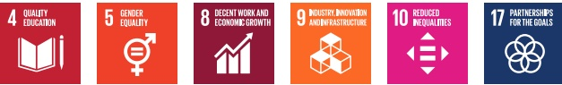

## Goals dashboard

Our ESG plan lays out ambitious goals for the decade $ ^{*} $ and beyond. We believe how we track our progress is critical. We organize our goals across four pillars: Advancing Sustainability, Cultivating Inclusion, Transforming Lives and Upholding Trust. Our pillars help us organize our ESG work and track progress against our goals.

Read about our progress in  $ \underline{\text{By the Numbers}} $. Learn more about the methodologies that we use to calculate progress toward each of our goals and key drivers in the  $ \underline{\text{Appendix}} $.

*The year presented within each goal statement refers to the calendar year that coincides with the majority of Dell's fiscal year. Our fiscal year is the 52- or 53-week period ending on the Friday nearest January 31. Our ESG activities, including goal progress, are primarily collected and reported by fiscal year, unless otherwise noted. The expected end date of each goal is the end of the associated fiscal year (e.g., "By 2030" refers to the end of Dell's Fiscal Year 2031).

4 QUALITY EDUCATION 5 GENDER EQUALITY 8 DECENT WORK AND ECONOMIC GROWTH 9 INDUSTRY INNOVATION AND INFRASTRUCTURE 10 REDUCED INEQUALITIES 17 PARTNERSHIP FOR THE GOALS

<table border=1 style='margin: auto; word-wrap: break-word;'><tr><td style='text-align: center; word-wrap: break-word;'>Material topic</td><td style='text-align: center; word-wrap: break-word;'>Social Goal</td><td style='text-align: center; word-wrap: break-word;'>Our status</td><td style='text-align: center; word-wrap: break-word;'>SDGs</td></tr><tr><td colspan="4">Transforming lives</td></tr><tr><td rowspan="5">Digital inclusion</td><td style='text-align: center; word-wrap: break-word;'>By 2030, we will improve 1 billion lives through digital inclusion</td><td style='text-align: center; word-wrap: break-word;'>FY24 396M 1B\nTotal number of people reached (cumulative, FY20 to current reporting year)</td><td style='text-align: center; word-wrap: break-word;'>4,9</td></tr><tr><td style='text-align: center; word-wrap: break-word;'>Key Driver: Each year through 2030, 50% of the total people directly reached will be those who identify as girls and women, or underrepresented groups</td><td style='text-align: center; word-wrap: break-word;'>FY24 50%\n51.5%</td><td style='text-align: center; word-wrap: break-word;'>5,10</td></tr><tr><td style='text-align: center; word-wrap: break-word;'>Key Driver: Each year through 2030, we will deliver future-ready skills development for workers in our supply chain</td><td style='text-align: center; word-wrap: break-word;'>FY24: Dell recorded 131,478 hours of future ready skills training at supplier sites and in-house manufacturing locations.</td><td style='text-align: center; word-wrap: break-word;'>8</td></tr><tr><td style='text-align: center; word-wrap: break-word;'>By 2030, 75% of our team members will participate in giving or volunteerism in their communities</td><td style='text-align: center; word-wrap: break-word;'>FY24 48% 75%\nPercentage of team members participating in giving or volunteering</td><td style='text-align: center; word-wrap: break-word;'>17</td></tr><tr><td style='text-align: center; word-wrap: break-word;'>Key Driver: By 2030, we will use our expertise and technology to support the digital transformation of 1,000 nonprofit partners</td><td style='text-align: center; word-wrap: break-word;'>FY24 535 1,000\nTotal number of nonprofit partners supported in their digital transformation journey</td><td style='text-align: center; word-wrap: break-word;'>9,17</td></tr><tr><td colspan="4">Cultivating inclusion</td></tr><tr><td rowspan="4">Inclusive workforce</td><td rowspan="2">By 2030, 50% of our global workforce and 40% of our global people leaders will be those who identify as women</td><td style='text-align: center; word-wrap: break-word;'>FY24 35.0% 50%\nPercentage of our global workforce who identify as women</td><td rowspan="2">5</td></tr><tr><td style='text-align: center; word-wrap: break-word;'>FY24 29.1% 40%\nPercentage of our global people leaders who identify as women</td></tr><tr><td rowspan="2">By 2030, 25% of our U.S. workforce and 15% of our U.S. people leaders will be those who identify as Black/African American or Hispanic/Latino</td><td style='text-align: center; word-wrap: break-word;'>FY24 16.1% 25%\nPercentage of U.S. workforce who identify as Black/African American or Hispanic/Latino</td><td rowspan="2">10</td></tr><tr><td style='text-align: center; word-wrap: break-word;'>FY24 12.6% 15%\nPercentage of people leaders in the U.S. workforce who identify as Black/African American or Hispanic/Latino</td></tr></table>