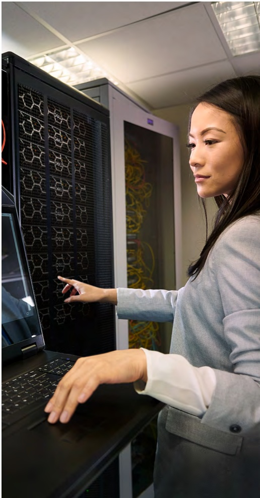

## Strategy

## Decarbonize our operations, customers and society

Our climate action strategy is comprehensive because we understand that no single solution will help us meet our climate goals. We incorporate carbon mitigation actions within our own operations, for our customers, partners and society:

- Decarbonize Dell: We internally reduce emissions, implement operational resilience strategies and manage the carbon footprint of our operations and products. We also engage with our suppliers to drive down emissions upstream of our operations.

• Decarbonize customers and partners: As part of a global technology chain, we support our customers' and partners' climate-related goals through breakthrough innovations.

• Decarbonize society: Our support for global climate goals drives engagement and advocacy on climate-related issues beyond our immediate community.

We ensure that our emissions data is tracked, managed and reported over time. We calculate emissions in accordance with the methodology set out in the Greenhouse Gas Protocol and follow industry best practices in terms of GHG accounting methodologies. We also align our emissions reduction key drivers to Science Based Targets initiative (SBTi) criteria. The ESG Goals and Key Drivers Methodology section contains additional details on how we measure progress to our key drivers.

## Greenhouse gas emissions by scope

SCOPE 1

Direct emissions from Dell Technologies-owned and -controlled resources.

F

## SCOPE 2

Indirect emissions related to consumption of purchased electricity, steam, heating and cooling.

un

## SCOPE 3

Indirect emissions associated with our supply chain, the use of our products by customers, activities like business travel and the transportation of goods and services.

回

SBTi has validated our updated set of 2030 emissions targets and classified our scopes 1 and 2 ambition as in line with a 1.5 degrees Celsius trajectory for climate change, which is the most ambitious target companies can set for scopes 1 and 2 emissions.

We continue to participate in the  $ \underline{\text{CDP Climate Change}} $ annual disclosure reporting our scopes 1, 2 and 3 footprint. We also ask and expect our suppliers to participate in  $ \underline{\text{CDP Supply Chain}} $ disclosure and to report their GHG emissions, reduction targets and mitigation plans.

## Public advocacy

We continued to hold paramount our commitments to advancing sustainability in FY24, with a focus on climate action and circular economy. We realize partnerships and collaboration are key to making a sizeable impact in both areas. For instance, we joined our peers in engagements to educate key stakeholders, including policymakers, on the importance of urgent climate action.

## In FY24, we also:

• Continued partnership with like-minded multinational companies as a member of the World Economic Forum's (WEF) Alliance of CEO Climate Leaders and participation in the WEF Climate Adaptation Community. Michael Dell signed the WEF business coalition  $ \underline{\text{letter}} $ in support of global climate action.

- Took part in CDP's 2023-2024 Science-Based Targets (SBT) Campaign. Campaign participants, which included financial institutions and other companies, were added to the CDP website and to a letter sent in October to over 2,100 CDP-targeted multinational businesses, a group that includes certain Dell suppliers, encouraging them to adopt SBTs.

• Continued our membership in the  $ \underline{\text{Digital Climate Alliance}} $ and the  $ \underline{\text{GridWise Alliance}} $.

• Supported a letter through our membership with the Responsible Business Alliance (RBA), urging the European Union's co-legislators to set a common European standard for responsible business conduct. This would pave the way for a cross-sectoral and EU-wide level playing field for sustainability due diligence: the Corporate Sustainability Due Diligence Directive (CS3D).