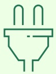
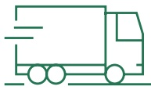

## Achieving net zero emissions

Getting to net zero greenhouse gas (GHG) emissions takes a deep understanding of our carbon footprint and setting ambitious near-term, science-based targets to achieve by 2030. Our 2030 reduction targets align with the categories where we have the greatest opportunity for impact.

<table border=1 style='margin: auto; word-wrap: break-word;'><tr><td rowspan="4">ONGOING ACTIONS TO NET ZERO</td><td style='text-align: center; word-wrap: break-word;'>SCOPE 1\nDIRECT\nEMISSIONS</td><td style='text-align: center; word-wrap: break-word;'>SCOPE 2\nINDIRECT\nEMISSIONS</td><td style='text-align: center; word-wrap: break-word;'>SCOPE 3 CATEGORY 3\nFUEL &amp; ENERGY</td><td style='text-align: center; word-wrap: break-word;'>SCOPE 3 CATEGORY 1\nPURCHASED\nGOODS &amp; SERVICES</td><td style='text-align: center; word-wrap: break-word;'>SCOPE 3 CATEGORY 6\nBUSINESS\nTRAVEL</td><td style='text-align: center; word-wrap: break-word;'>SCOPE 3 CATEGORY 4\nLOGISTICS</td><td style='text-align: center; word-wrap: break-word;'>SCOPE 3 CATEGORY 11\nUSE OF SOLD\nPRODUCTS</td></tr><tr><td style='text-align: center; word-wrap: break-word;'></td><td style='text-align: center; word-wrap: break-word;'>

U

</td><td style='text-align: center; word-wrap: break-word;'>

0

</td><td style='text-align: center; word-wrap: break-word;'>

同

</td><td style='text-align: center; word-wrap: break-word;'>

X

</td><td style='text-align: center; word-wrap: break-word;'>

8

</td><td style='text-align: center; word-wrap: break-word;'>

二

</td></tr><tr><td style='text-align: center; word-wrap: break-word;'>Focus on eliminating GHG-emitting fuels in our buildings and vehicles\nTransition to low- or no-emissions cooling systems for our buildings and equipment\nDrive scope 2 emissions to nearly zero by sourcing 100% of electricity from renewable sources by 2040\nReduce our dependence on fossil fuels and increase use of renewables</td><td style='text-align: center; word-wrap: break-word;'>Reduce our dependence on fossil fuels and increase use of renewables</td><td style='text-align: center; word-wrap: break-word;'>Partner with suppliers to improve reporting and reduce their operational and upstream emissions footprint\nInclude product carbon footprint in our design decisions</td><td style='text-align: center; word-wrap: break-word;'>Reduce emissions from air and rail travel by using technology to replace in-person travel\nUse lower-carbon transport options like electric vehicles, where possible</td><td style='text-align: center; word-wrap: break-word;'>Optimize our transportation network\nPartner with key carriers for transportation efficiencies\nAdvocate for industry-wide transition to lower carbon footprint transportation fuels</td><td style='text-align: center; word-wrap: break-word;'>Reduce the energy intensity of our products\nAdvocate for global renewable electricity policies\nSupport our customers&#x27; transition to renewable electricity</td><td style='text-align: center; word-wrap: break-word;'></td></tr><tr><td style='text-align: center; word-wrap: break-word;'>50%\nREDUCTION\nin operational emissions</td><td style='text-align: center; word-wrap: break-word;'></td><td style='text-align: center; word-wrap: break-word;'>45%\nREDUCTION\nin absolute emissions from purchased goods and services</td><td style='text-align: center; word-wrap: break-word;'></td><td style='text-align: center; word-wrap: break-word;'></td><td style='text-align: center; word-wrap: break-word;'>30%\nREDUCTION</td><td style='text-align: center; word-wrap: break-word;'>in absolute emissions associated with the use of sold products</td></tr></table>